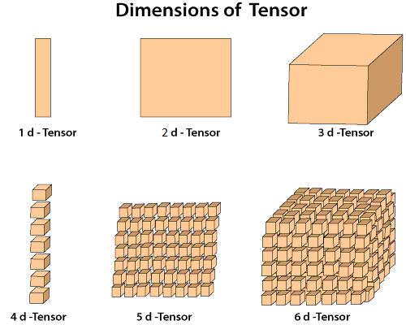

# Pytorch深度学习框架入门-张量


了解Pytorch中关于张量的内容

<!--more-->

# 张量

Pytorch官网解释张量为一种特殊的数据结构，给我的感觉是一种数据的分组方式，从最小的一组开始分组，然后逐渐分大组，感觉上类似对数据进行抽象，逐渐形成不同层次的概念，hierarchy of abstract？

Pytorch中的张量与NumPy的ndarrays数据类型相似,两者可以相互转换。



导入torch与numpy包

```python
import torch
import numpy as np
```

## 生成张量

- 已有shape的数据生成张量
- 自定义一个shape大小
- 赋值给torch
- numpy转张量

```python
torch.tensor(data)  # data为列表形式[[1,2],[3,4]]
torch.rand_like(data) # 根据data的shape，来确定张量的shape
torch.ones_like(data)

torch.rand(shape) # shape为元组形式(2,4,)
torch.ones(shape) # 根据元组，来确定张量的shape
torch,zeros(shape)

torch.rand(x,y,z) # x,y,z为整数
torch.ones(x,y,z)

t1 = torch.from_numpy(x) # x是numpy的数据类型
t1.numpy() # 张量转numpy
```

## 操作张量

- 基本数学运算
- 复杂数学运算-函数

```python
# This computes the matrix multiplication between two tensors. y1, y2, y3 will have the same value
# 矩阵乘法
y1 = tensor @ tensor.T  # @ matmul
y2 = tensor.matmul(tensor.T)
y3 = torch.rand_like(tensor)
torch.matmul(tensor, tensor.T, out=y3)


# This computes the element-wise product. z1, z2, z3 will have the same value
# 对应位置元素相乘
z1 = tensor * tensor # *
z2 = tensor.mul(tensor)
z3 = torch.rand_like(tensor)
torch.mul(tensor, tensor, out=z3)


torch.full((3,2),46) # 形成只有一个数值的张量
torch.sin(t) # 对张量的每个元素进行sin
torch.reshape(4,3,5) # 对张量的数值重新分组
```


